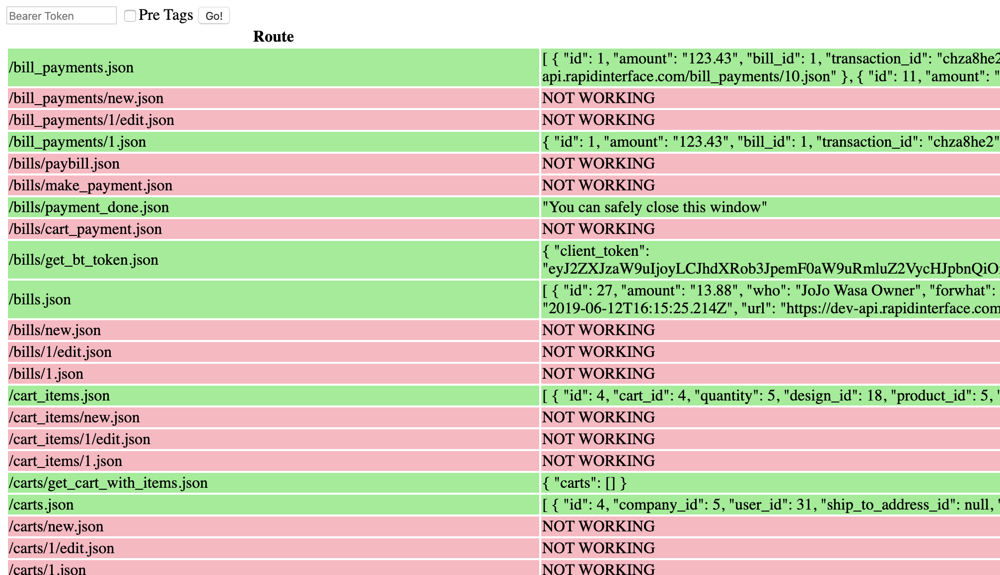

# api-scraper

Tool made to scrape GET routes from a rails server error page, hit all of those routes, and display if they are working, and what data they return.

## Prerequisites

[Node.js](https://nodejs.org/en/)

## Installation
- Download or clone this repo.
- In the base directory create a file named `.env` This file should contain a single line `API_URL=https://www.yoururl.com/route` This url should hit a route that displays the rails error page.
- From this directory in your terminal run `npm install` and then `npm start`. Access the page at `http://localhost:5000/`

## Usage
- Paste your Bearer token in the input field at the top of the page.
- Checking the box for pre tags will increase the readability of the output at the expense of page length.
- Hit the go button, the table will populate once all routes have been hit, this may take a while.